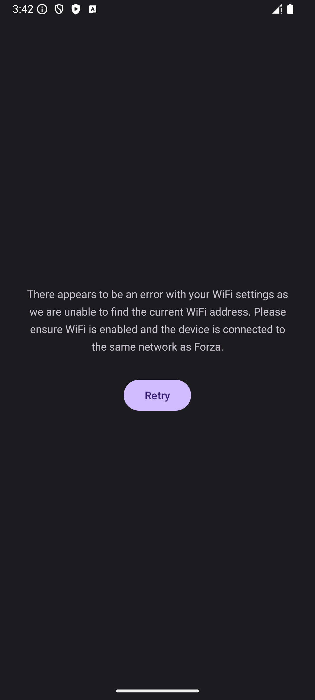
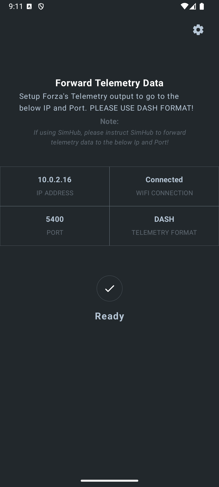
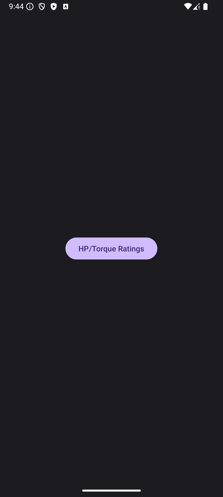
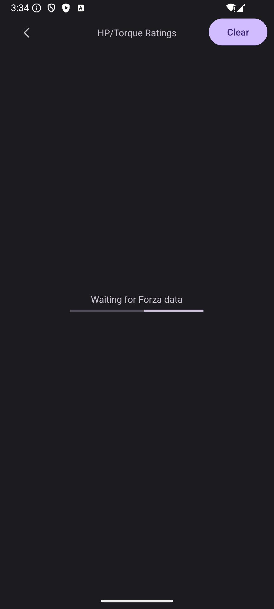
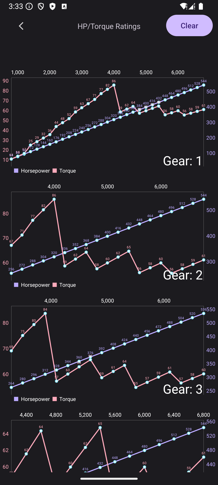

# forzautils_android
Android application for monitoring Forza telemetry data.
This app requires the `motorsport` branch of [ForzaTelemetryAPI](https://https://github.com/dusanders/ForzaTelemetryAPI)
Please clone the repository beside this project so Gradle will build - or, adjust the gradle to point to the proper directory.
```gradle
android {
    .
    .
    .
    sourceSets {
        getByName("main") {
            java {
                srcDir("../../ForzaTelemetryApi/src")
            }
        }
    }
}
```

---
---

# App Info

Build and deploy the app to an Android device. 

The device MUST be connected to WiFi - preferably the same WiFi as the Forza game.



---

The app will display the device's IP and Port number to forward telemetry data to. 



Forward telemetry data to the IP and Port - if using `SimHub`, setup `SimHub` to forward data to IP and Port.

NOTE: Ensure data is in DASH format - not STEP! 

Tap `Ready` whenever forwarding is setup. 

### *__Data is not required at this point.__*

---

Next, choose the data view: `currently on HP / Torque curves are supported`



---

App will then wait for Forza data



---

Drive in Forza - the app will plot the horsepower and torque for each gear as you drive. Only the highest readings are recorded for each rpm and only at throttle over 95%.



Use the `Clear` button to erase the plots and start over.

---

## There is no requirement to the order of gears or starting speed. The app will adjust its charts as you drive - creating new charts for any new gear or rpm received.