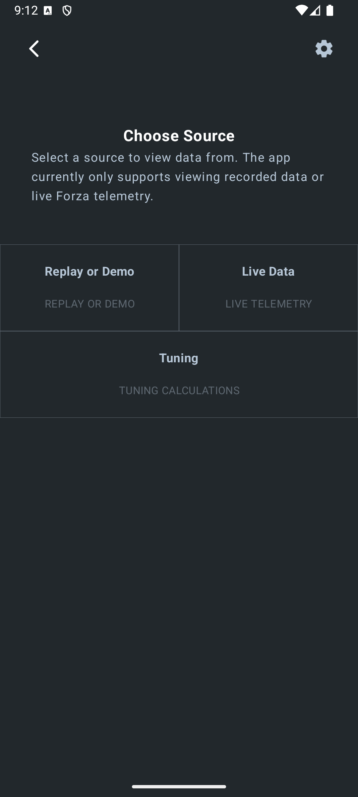

# forzautils_android
Android application for monitoring Forza telemetry data.
This app requires the UDP and data parser project here: [ForzaTelemetryData](https://github.com/dusanders/ForzaTelemetryData)
Please clone the repository beside this project so Gradle will build - or, adjust the gradle to point to the proper directory.

Project settings.gradle.kts:

```gradle
    .
    .
    .
rootProject.name = "ForzaUtils"
include(":app", ":data")
project(":data").projectDir = file("../ForzaTelemetryData/data")
```

App build.gradle.kts:
```gradle

dependencies {
    .
    .
    .
    implementation(project(":data"))
    .
    .
    .
}
```
---
---

# App Info

Build and deploy the app to an Android device. 

---

The app will display the device's IP and Port number to forward telemetry data to. 


Forward telemetry data to the IP and Port - if using `SimHub`, setup `SimHub` to forward data to IP and Port.

NOTE: Ensure data is in DASH format - not STEP! 

Tap `Ready` whenever forwarding is setup. 

---

The app allows for Live data, replays, and a tuning calculator



---

Preview of tuning calculator:


---

Replay:

